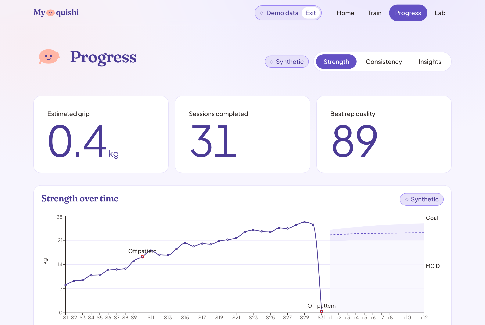
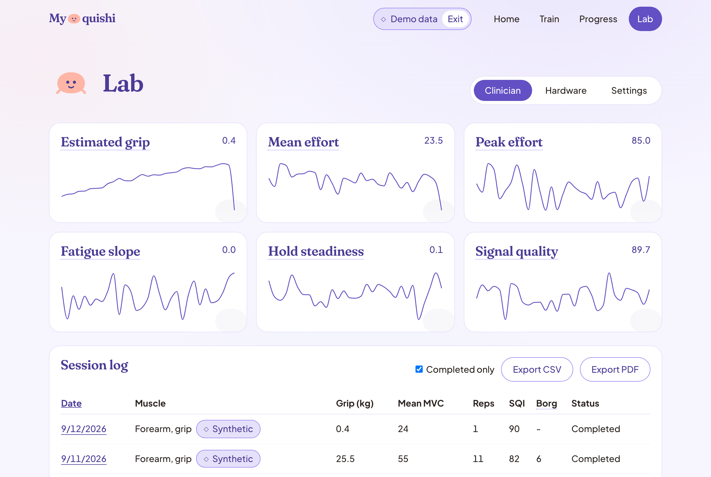
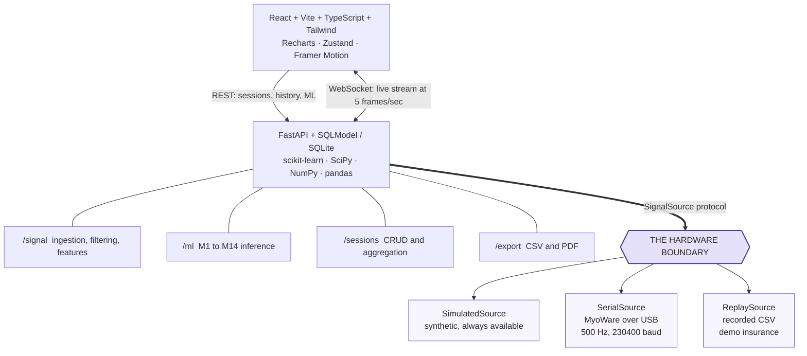
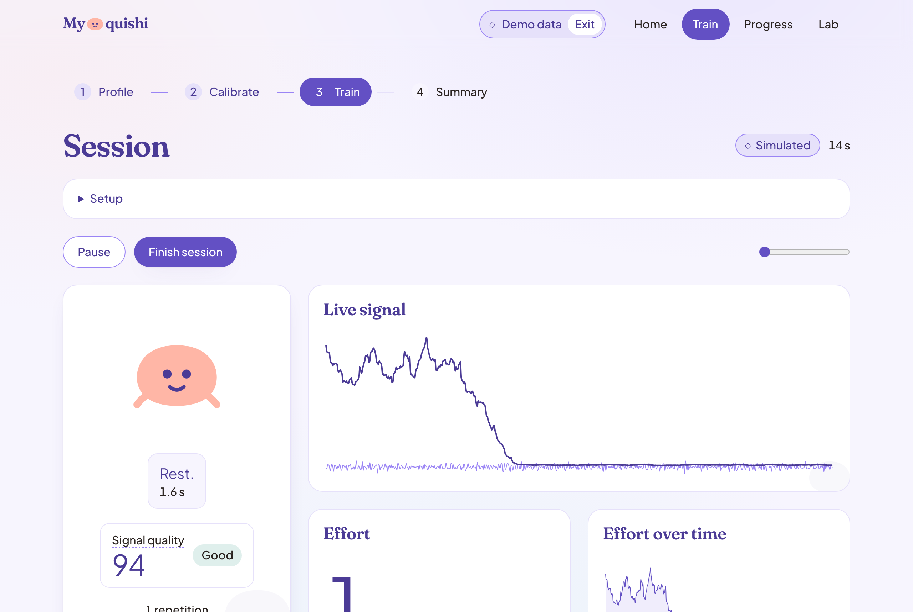
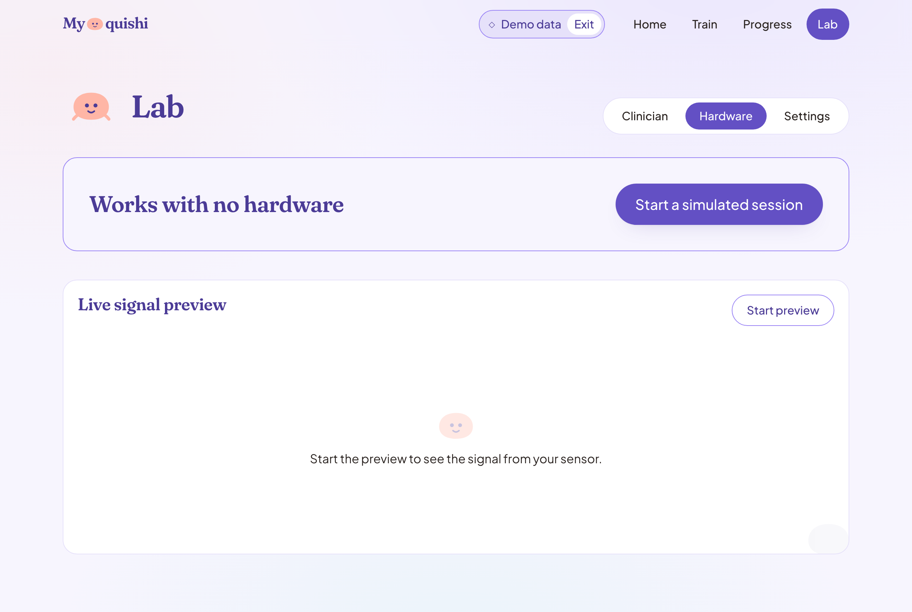

# MySquishi

A grip strength rehabilitation companion built around a surface EMG sensor. It
reads muscle activity from a MyoWare sensor on an Arduino, turns it into
repetition counts, effort levels and objective fatigue measurements, and shows
a patient how they are progressing over weeks.

**The whole app runs with no hardware attached.** Simulation is a permanent
feature rather than a fallback: the full session flow, every chart and all
fourteen models work against a synthetic signal generator. Plugging a sensor in
adds real measurements; it is never a prerequisite.

> Not a medical device. Nothing here diagnoses, treats or screens for any
> condition. Every figure is an estimate from a hobbyist sensor, and the
> reference populations are synthetic.



## What it does

Four routes: Home, Train, Progress and Lab.

| | |
|---|---|
| **Train** | Profile, calibration, then a live session with a rolling oscilloscope, effort meter, repetition detection and a coach |
| **Progress** | Strength trend with forecast, consistency, and the model insights behind both |
| **Lab** | The clinician view, the hardware guide, and settings |


- **Live session.** A rolling oscilloscope, an effort meter, repetition
  detection and a coach that tells you when to squeeze and when to rest.
- **Objective fatigue.** Median frequency decline across a session, which is a
  real physiological measurement rather than a self report.
- **Progress over time.** Strength trend with a forecast and its uncertainty,
  plateau detection, adherence tracking and anomaly flagging.
- **A clinician view.** Sortable session log, sparklines, and export as CSV or
  as a PDF report carrying the headline measures, the trend and the log.
- **Any muscle.** Forearm grip, biceps, calf, or anything else you can place
  electrodes over.

## Honesty rules

These are constraints the code enforces, not aspirations.

**No bare point estimates.** Every prediction ships with an interval. Intervals
persist as three columns rather than a JSON blob, so the rule survives the trip
through the database.

**Synthetic data is labelled synthetic, in the UI.** The badge derives from the
signal source object itself, never from page copy, so a simulated session
cannot be presented as a live one.

**Clinical claims are gated by muscle.** Phase 2 measurements showed the rig
resolves how hard a muscle is working, not which motion produced it. Effort and
fatigue are properties of motor unit recruitment, so they generalize to any
skeletal muscle. Kilograms do not: the force model is fitted per muscle per
person, and the EWGSOP2 thresholds it feeds are sarcopenia references validated
on hand dynamometry. So force in kilograms, EWGSOP2 status and population
percentile are reported for forearm grip and for nothing else. The backend
omits those fields entirely rather than sending them empty.



## Accessibility

A floor, not a nice to have, and enforced where it can be:

- responsive down to 390px, verified as zero horizontal overflow on every route
- visible keyboard focus on every interactive element, including a skip link
- `prefers-reduced-motion` respected, and Squishi stops animating
- AA contrast throughout, computed in a test rather than asserted in a document
- no information by colour alone, so every coloured state carries a label or a shape

The contrast rule is the one worth singling out. It was written down long before
it was true: measuring the palette found white on the primary violet at 4.40,
the alert red at 3.50 and the good teal at 2.99, against a 4.5 floor. All were
darkened, and `frontend/src/lib/contrast.test.ts` now fails the build if any of
them drifts back.

## What the sensor can and cannot do

Measured on real hardware rather than assumed. Full numbers in
[docs/HARDWARE_FINDINGS.md](docs/HARDWARE_FINDINGS.md).

| | |
|---|---|
| Signal quality | **Tier A.** 33.8x contrast between rest and contraction, no clipping, no drift |
| Effort levels | **Three**, separable. Light versus medium is the tightest real pair at Cohen's d = 1.54 |
| Individual fingers | **Not decodable.** Middle versus ring separated at d = 0.03, statistically identical |
| Grip versus wrist flexion | **Not distinguishable.** d = 0.12, the same event on this channel |

The finger result is a physical limit, not a tuning problem: the finger
compartments of flexor digitorum superficialis sum into one differential
electrode pair. Decoding per finger needs an 8 to 16 channel array. So the app
does not offer per finger features, and does not claim more than three effort
levels.

One consequence of sampling at 500 Hz: Nyquist is 250 Hz, so the upper part of
the sEMG band is unobserved and median frequency values are not comparable to
published figures. Trends within a session, which is what fatigue actually
measures, hold regardless. The UI says so wherever fatigue appears.

## Architecture



`SignalSource` is the load bearing decision. It is a structural Protocol with
five members, so a new source needs no base class and no edits to any consumer.
Adding real hardware meant writing two classes and registering them in one
factory function. Nothing else moved.



## Running it

Two processes. Use the absolute virtualenv paths: a bare `python` may resolve to
an unrelated environment.

```bash
# Backend, on port 8000
cd backend
/usr/local/bin/python3 -m venv .venv
.venv/bin/pip install -r requirements.txt
.venv/bin/uvicorn app.main:app --reload --port 8000
```

The venv is created with the absolute interpreter path on purpose. A bare
`python3` can resolve to a conda environment that happens to be first on the
PATH, and the venv then inherits it. See the toolchain note in
[docs/ARCHITECTURE.md](docs/ARCHITECTURE.md).

```bash
# Frontend, on port 5173, proxying /api to the backend
cd frontend
npm install
npm run dev
```

Open http://localhost:5173. The database seeds itself with a demo patient on
first start, so the dashboard has history to show immediately.

The schema is created with `create_all`, which creates missing tables but never
alters existing ones. There is no migration tool, so after a change to a table
definition a database created before that change keeps the old schema. Delete
`backend/data/mysquishi.db` and restart to pick it up: the demo reseeds itself.

### Tests

The test runner is not in `requirements.txt`, so that a deployed instance does
not install one. Add it once:

```bash
cd backend && .venv/bin/pip install -r requirements-dev.txt
```

```bash
cd backend  && .venv/bin/python -m pytest    # 429 tests
cd frontend && npm run test && npm run build # 121 tests
```

Two of those are worth knowing about, because they encode rules rather than
behaviour. `frontend/src/lib/contrast.test.ts` computes WCAG ratios for the
palette and fails if any drops under AA, and `frontend/src/lib/tokens.test.ts`
reads `index.css` from disk to catch a colour changed in one place and not the
other.

## Deploying

One Render web service serves both the API and the built frontend. That is the
whole configuration: the frontend requests `/api` as a relative path and opens
its websocket at `window.location.host`, so a shared origin means there is no
API URL to set, no CORS origin to keep in sync, and `wss:` follows from `https:`
on its own.

The blueprint is `render.yaml` at the repository root.

1. Push the branch to GitHub.
2. On Render, choose **New > Blueprint** and point it at the repository. It
   reads `render.yaml` and fills in the build and start commands. If you would
   rather not use a blueprint, choose **New > Web Service** and copy the
   `buildCommand` and `startCommand` out of that file by hand.
3. Wait for the first build. It is slow, a few minutes: it installs SciPy and
   scikit-learn and builds the frontend.
4. Open the `onrender.com` URL. The dashboard, the forecast and the live session
   all work on that one origin.

The trained models and the synthetic cohort are committed, so the build is a
plain install with no training step. The SQLite database is not committed:
Render's filesystem is ephemeral, and the app reseeds the demo patient on every
boot. Anything a visitor saves is gone on the next deploy, which is the right
behaviour for a demo but worth knowing.

### Keeping it awake

A free Render service sleeps after about 15 minutes idle, and the next visitor
waits through a cold start. An external monitor polling `/api/health` prevents
that:

- **UptimeRobot**: add an **HTTP(s)** monitor for
  `https://<your-app>.onrender.com/api/health` on a 5 minute interval.
- **cron-job.org** does the same job if you prefer it.

One caveat. Render's free tier allows 750 instance hours a month and a service
kept permanently awake burns about 730, so this uses nearly the whole allowance
and a second free service would go over. The paid Starter tier does not sleep at
all, which removes the need for the monitor entirely.

## Connecting the sensor

Optional. The Hardware tab of the Lab page (`/lab?tab=hardware`) walks through
it with a live signal preview, which is the fastest way to know your wiring is
right: squeeze, and the trace moves.



```
MyoWare 2.0 sensor        on the muscle, output selector set to RAW
      |
      v  snap connectors
3 electrodes              2 on the muscle belly 2 cm apart, 1 on nearby bone
      |
      v  3.5 mm TRS cable
Link Shield -> Arduino Shield -> Arduino Uno, pin A0
      |
      v  USB data cable, not a charge only cable
MySquishi                 serial at 230400 baud
```

The single most common mistake is leaving the output selector on ENV, which is
the factory default and wrong for this pipeline. Set it to RAW.

Hardware bring up details, electrode placement per muscle and the failure table
are in [docs/HARDWARE_CHECKLIST.md](docs/HARDWARE_CHECKLIST.md).

## The models

Fourteen, M1 to M14: signal quality, force regression, repetition quality,
spectral fatigue, anomaly detection, perceived exertion, prescription, forecast,
time to goal, plateau detection, archetype clustering, adherence, and cohort
percentile. Each ships with an explanation of what drove it, and reports when it
has fallen back to a documented heuristic rather than a trained artifact.

Inputs, outputs and fit timing are in [docs/ML.md](docs/ML.md).

## Documentation

| File | Holds |
|---|---|
| [WORKFLOW.md](docs/WORKFLOW.md) | How agents work in this repo |
| [TASKS.md](docs/TASKS.md) | The checkbox board, grouped by build phase |
| [ARCHITECTURE.md](docs/ARCHITECTURE.md) | System design, the SignalSource boundary, the clinical gate |
| [DESIGN.md](docs/DESIGN.md) | Palette, typography, mascot, copy voice, accessibility floor |
| [CLINICAL.md](docs/CLINICAL.md) | Clinical terminology reference |
| [ML.md](docs/ML.md) | The M1 to M14 stack |
| [HARDWARE_CHECKLIST.md](docs/HARDWARE_CHECKLIST.md) | Wiring, placement, bring up protocol |
| [HARDWARE_FINDINGS.md](docs/HARDWARE_FINDINGS.md) | What the rig measured, and what that rules out |
| [PHASE3_GUIDE.md](docs/PHASE3_GUIDE.md) | How the hardware layer was built |

The screenshots above are regenerated by `backend/tools/screenshots.py`, which
drives headless Chrome over the DevTools protocol and needs no extra
dependency. With the frontend built and the app running on port 8090:

```bash
cd backend && .venv/bin/python -m tools.screenshots
```
